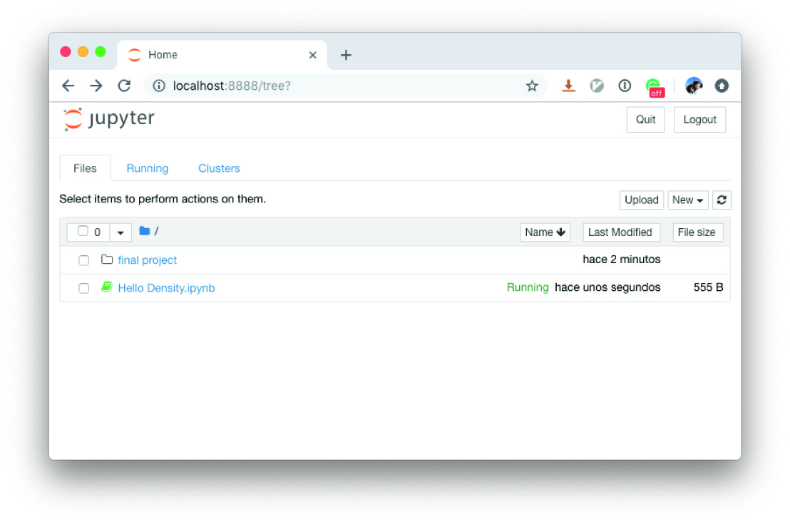
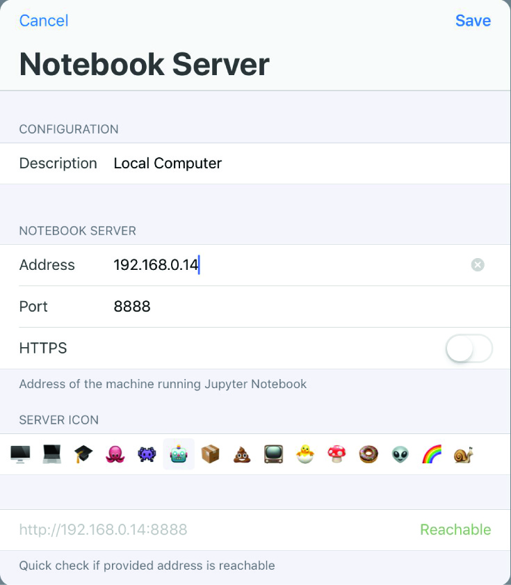
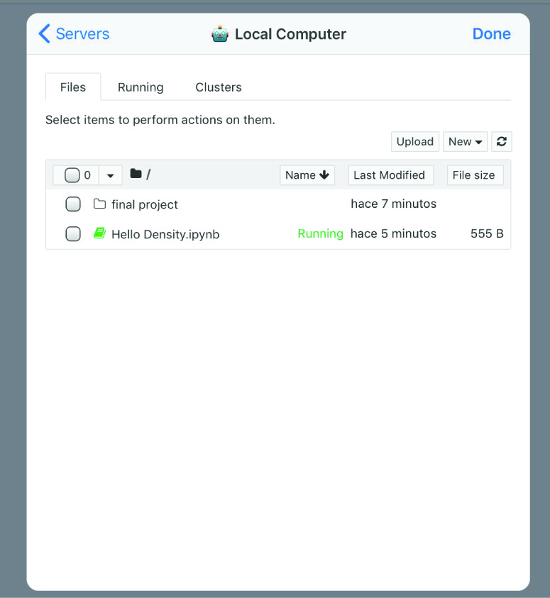
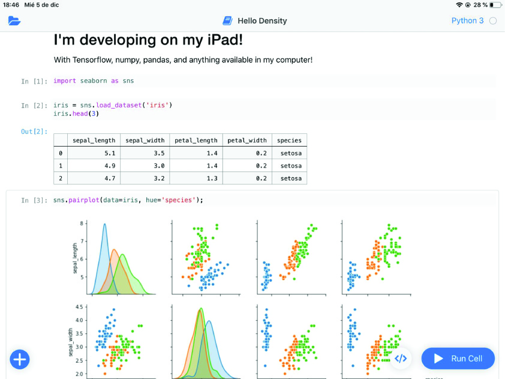

Wondering about how to perform Data Science on the iPad? Unfortunately, there are just a few apps that let you get close to Data Science on iOS, either by allowing you to program, analyze data, or connect to external sources. That last part, connecting to external sources, may come very handy to solve the lack of iOS programming applications.

A very common tool to perform Data Science experiments is the live-coding Jupyter Notebooks app. A “notebook” is just a document where you can write code (or markdown), run it, and get immediately feedback about its output. Even when we cannot natively run a Jupyter environment on the iPad, we can connect to a remote server and get all the features it provides directly on our tablet thanks to an app called [Juno](https://juno.sh/).

The app is free, but in order to connect to remote servers, you have to pay **$10.99 USD, which is totally worth it!**

I’ll explain what you need to set up everything and how to do it. Let’s start with the requirements:

## Requirements
1. A **computer** with [Jupyter installed](http://jupyter.org/install.html)
2. An **iPad** with the [Juno app installed](https://itunes.apple.com/app/juno-jupyter-notebook-client/id1315744137)
3. A static IP Address to access the computer remotely (or use *ngrok*)
4. Allow remote connections in the Jupyter server

To fulfill the first requirement you can install Jupyter as [described here](http://jupyter.org/install.html). **TL;DR**: `python3 -m pip install jupyter`

Then, in your iPad find the Juno app on the App Store and install it. Open it and you will see the option to buy **Juno Pro**. **Buy it**. You can also try the example notebooks already provided.

## Enabling Remote Access to Jupyter Notebook

Now, we will enable **remote access to the Jupyter notebooks.** The instructions are [detailed here](https://jupyter-notebook.readthedocs.io/en/stable/public_server.html) but I’ll briefly explain them.

1. **Check if you already have a configuration file.** Locations:
- Windows: `C:\Users\USERNAME\.jupyter\jupyter_notebook_config.py`
- macOS: `/Users/USERNAME/.jupyter/jupyter_notebook_config.py`
- Linux: `/home/USERNAME/.jupyter/jupyter_notebook_config.py`

2. **Generate a notebook config file**. If you already have it, skip this step.
    jupyter notebook --generate-config

3. **Edit the default listening IP Address to** `**0.0.0.0**`**.**

Open the file:

    nvim ~/.jupyter/jupyter_notebook_config.py

> Replace `nvim` with your favorite editor and the config file with your specifics.

Find the line that starts with `c.NotebookApp.ip`, uncomment it and assign it the value `'``**0.0.0.0**``'`. It should be something like this:

    ## The IP address the notebook server will listen on.
    c.NotebookApp.ip = '0.0.0.0'

Save your changes and close the file.

4. **Setup a security password** with something like this:
    $ jupyter notebook password
    Enter password:  ****
    Verify password: ****
    [NotebookPasswordApp] Wrote hashed password to /Users/gomezhyuuga/.jupyter/jupyter_notebook_config.json
5. **Use the same password to run the following.**
    testing ❯ jupyter console
    Jupyter console 6.0.0
    
    Python 3.7.1 (default, Nov  6 2018, 18:46:03)
    Type 'copyright', 'credits' or 'license' for more information
    IPython 7.2.0 -- An enhanced Interactive Python. Type '?' for help.
    
    In [1]: from notebook.auth import passwd
    In [2]: passwd()
    Enter password: ****
    Verify password: ****
    Out[2]: 'sha1:0ea5b4fcd860:7e96de01d3f41112f15b7d0514c3d177e7c89db9'

Save the hashed password (**"**`**sha1:…**`**")** for later.

6. Open your Jupyter’s config file again and add the following line to it:
    c.NotebookApp.password = u'sha1:0ea5b4fcd860:7e96de01d3f41112f15b7d0514c3d177e7c89db9'

Replace the hashed password with your own.

7. **Run Jupyter** and keep it alive.
    $ jupyter notebook

It should open your default web browser with the default welcome page.

That’s it for setting up Jupyter so let’s connect to it using Juno.

## Connecting to the Jupyter Server From the iPad

**Note.** The iPad **must be in the same network as your computer** in order for this to work. In the following section, I’ll explain how to access it from an external network.

Open Juno and select **Add new Notebook Server**. Then introduce the following values:

Replace the Address value with your own local IP Address, change the **Port** if you are not using the default one. Finally, disable HTTPS (the configuration to enable it is more complicated, but if you want to use HTTPS you can check [how to](https://jupyter-notebook.readthedocs.io/en/stable/public_server.html) [enable it here](https://jupyter-notebook.readthedocs.io/en/stable/public_server.html)).

The status at the bottom right-hand side should say **“Reachable”.** Tap in **Save** and then connect to the server.

You should see your notebook list. Select any one and there you go… **now you can start programming on your iPad!**

## Accessing Your Local Computer From an External Network

If you have a static IP Address in your home then you just have to indicate that address in the Juno app server settings, then, setup your local router with port forwarding.

However, if you live in Mexico or in a place where most ISP providers assign you a shared IP, you won’t be able to access your computer from outside the network. Nevertheless, there are some tools that can help us with that. For example, [**ngrok**](https://ngrok.com).

> ngrok allows you to expose a web server running on your local machine to the internet. Just tell ngrok what port your web server is listening on.

**Installation**
In macOS you can install it with [*Homebrew*](https://brew.sh/):

    $ brew install ngrok

See other [**installation options here**](https://ngrok.com/download). Then, go to ngrok’s website, create an account and [setup your token](https://ngrok.com/download).

**Expose your local 8888 port**
Jupyter Notebook should be running on your local machine at the default port `8888`. To expose it to the public, open a terminal and run:

    $ ngrok tcp 8888
    ngrok by @inconshreveable                             (Ctrl+C to quit)
    
    Session Status                online
    Account                       Fernando Gomez (Plan: Free)
    Version                       2.2.8
    Region                        United States (us)
    Web Interface                 http://127.0.0.1:4040
    Forwarding                    tcp://0.tcp.ngrok.io:17938 -> localhost:8888
    
    Connections                   ttl     opn     rt1     rt5     p50     p90
                                  0       0       0.00    0.00    0.00    0.00

Now, setup a new server in the Juno app with those configurations; set the **IP Address** and **port** to the ones provided by ngrok and you should be able to access it from outside your local network.
In my case, the IP Address is `**tcp://0.tcp.ngrok.io**` and the port is `**17938**`. Those values will change dynamically.

## Final Thoughts

Having access to the whole Jupyter environment from the iPad comes in handy when you have to test something and you are not on the computer. The only downside is that you need to have a computer running on some other side and connected to the Internet. It also becomes tedious keeping track of the IP Address and ports each time you run ngrok. However, you are free to pay an upgrade for your ngrok’s account, with that you will be able to expose more than one service and also custom subdomains, which will let you have a static address for further usage.

When I was in school, I didn't want to carry my computer all the time (my backpack started to get very heavy!) so for me, this was the best solution I could come up with. It enabled me to leave my computer at home and only carry and program on the iPad.

I hope this could be as useful for you, as it was for me.
