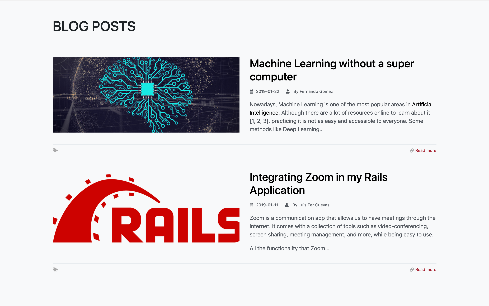

Some time ago at Density Labs, we decided to remodel our website. As we started discussing the technology we should use to rebuild it many were mentioned. [ReactJS](https://reactjs.org/) is one of our favorite technologies so it would be a great choice to build a new website based on it. Some developers asked us why should we use [ReactJS](https://reactjs.org/) when we could use a CMS to build it in less time. After analyzing the options, we found that the best option for our case was [GatsbyJS](https://www.gatsbyjs.org/) due to it using [ReactJS](https://reactjs.org/), having cool tools that facilitate development, and the community having a lot of interest in this technology, but...

#### What is GatsbyJS?

[GatsbyJS](https://www.gatsbyjs.org/) is a powerful creator of static websites that implements innovative technologies. It's more than just a new creator of static websites, it gives the opportunity to get information from different sources through the power of GraphQL and use the data with [ReactJS](https://reactjs.org/) to build amazing websites. 

It doesn’t only give an awesome final product, but it also provides a complete experience in the development process with its ease of coding, the versatility to deploy to different server providers, its amazing hot-reloading feature, the great asset optimization that gives high performance on the app, and much more. 


Once [GatsbyJS](https://www.gatsbyjs.org/) was chosen as the winner to build our company’s new website, I started to research this technology since for me it was something new and my knowledge about ReactJS was basic.

Next, I’ll share with you what it was like to work on a project with [GatsbyJS](https://www.gatsbyjs.org/).

#### The Challenge: Moving the Old Site on to [GatsbyJS](https://www.gatsbyjs.org/)

As most people do when they start learning a new technology, I started following the official tutorial. At first, all was going wonderfully, the tutorial had everything from how to set the configuration, and add styles and tips to deploying the app to different web servers.

Everything was going well, but building our site was more complex than following a tutorial, and adding a blog section didn’t seem to be as easy as it sounded. Well, it turns out that it was, [GatsbyJS](https://www.gatsbyjs.org/) is a great option for when you want to build a blog.  

I’ll share with you how it was that we made it. There are different ways to do it but this was the path we chose.

#### Implementation

I created three components: `Layout`, `Container` and `PostItem`. The last one is used to show a blog post's image and summary.


  

```javascript
const Blog = ({ data }) => {
  const posts = dataToBlogPosts(data)
  return (
    <Layout>
      <Container className="py-5">
        <h1
          className="border-bottom pb-3"
        >
          BLOG POSTS
        </h1>
        {
        posts.map((post, i) => (
          <PostItem post={post} key={i}/>
        ))
      }
      </Container>
    </Layout>
  )
}
```

Let's see the code of the PostItem component:

#  
```javascript
import React from 'react'
import {
  Col,
  Row,
} from 'reactstrap';
import {
  Link
 } from 'gatsby';

const PostItem = ({
  post
}) => (
  <Row className='my-5'>
    <Col md="6" className="mb-3" >
      
    </Col>
    <Col md="6">
      <h2>
        <Link
          to={'/blog/${post.slug}'}
        >
          { post.name }
        </Link>
      </h2>
      <div dangerouslySetInnerHTML={{ __html: post.summaryHtml }}/>
    </Col>
  </Row>
)

export default PostItem

PostItem.propTypes = {
 posts: PropTypes.object,
}

```

Now, let's see how the information is taken from a markdown file using [GraphQL](https://graphql.org/)

```javascript
export const pageQuery = graphql`
  query {
    allMarkdownRemark(
      filter: {fileAbsolutePath: {regex: "//(posts)/.+/.*.md$/"}}
      sort: {fields: [frontmatter___date], order: DESC}
    ) {
      edges {
        node {
          id
          frontmatter {
            name
  author
            slug
            image{
              childImageSharp {
                original {
                  src
                }
              }
            }
          }
          excerpt(pruneLength:250,format:HTML)
        }
      }
    }
  }
`
```

And this is the expected template for the Markdown files.

```
---
name: <the-blogpost-name>
date: <yyyy-mm-dd>
slug: <the-slug>
image: <path-to-image>
author: <name-of-the-author>
---
<content>
...
```

Now, let's see how the parser to read the Markdown files looks like:

```javascript
const dataToBlogPosts = data => {
  const edges = data.allMarkdownRemark.edges;
  return {
    id: edge.node.id,
    name: edge.node.frontmatter.name,
    date: edge.node.frontmatter.date,
    imageSrc: edge.node.frontmatter.image.childImageSharp.original.src,
    author: edge.node.frontmatter.author,
    summaryHtml: edge.node.excerpt,
  }
};
``` 

This way we can build the list of posts with their title, image, and summary.

So...

After almost two months working with [GatsbyJS](https://www.gatsbyjs.org/), we are convinced that [GatsbyJS](https://www.gatsbyjs.org/) was the best choice for the project. Here is why: 

- We built the website in less time than estimated.
- The site loads faster than the old website did
- GatsbyJS has lots of plugins that made the development easier.
- The framework is very easy to use.

Even though it is called a static website generator, we found that it is much more than that. It's a framework that has much to offer, the community knows that and they are actively contributing to it. 

#### In Summary 

Using [GatsbyJS](https://www.gatsbyjs.org/) for the first time was a great experience for me because it introduced me to two innovative technologies: [ReactJS](https://reactjs.org/) and [GraphQL](https://graphql.org/). On the one hand, you learn the magic that you can do with ReactJS, and on the other, the ease of getting data with [GraphQL](https://graphql.org/) is awesome, among other things I could say about it.

Something about [GatsbyJS](https://www.gatsbyjs.org/) that caught my attention was its “hot-reloading” feature which was handy when coding. Re-using components for different pages is something I liked a lot, also, the thing that I loved the most is the performance improvement I saw on the website. The site works very fast, it feels like a single page app and when the site is loaded it can continue working without an internet connection. 

If you're interested in learning [ReactJS](https://reactjs.org/), let [GatsbyJS](https://www.gatsbyjs.org/) whisk you away to the amazing world of component-oriented programming and, at the same time, build your static websites in a new and easy way.


If you want to know more about ReactJS or GatsbyJS you can contact us [here](https://densitylabs.io/contact-us).


See more details about GatsbyJS [here](https://www.gatsbyjs.org/).
