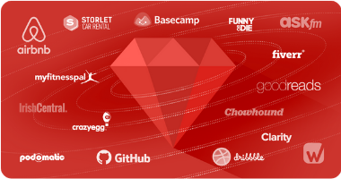

The programming and software development world is ever evolving, and when it comes to developing a new innovation, your toolbox is large. There’s a multitude of [languages](https://www.computerscience.org/resources/computer-programming-languages/) and [frameworks](https://magora-systems.com/app-development-framework/) at your disposal, and although many of them are flexible enough that they can be used to tackle many of the same projects, every project is unique, and requires the right tools for the job.

So how [Ruby-On-Rails](https://guides.rubyonrails.org/getting_started.html) is contributing the world of programming in 2019? What makes it unique and different? Why is it a popular option these days?
[Ruby-on-Rails](https://guides.rubyonrails.org/getting_started.html) has been transforming itself by undergoing a lot of changes, such as a new version was released in December 2018 and it has boosted the performance and added many new features such as the initial implementation of JIT compiler. Users are experiencing a performance boost up to 1.7x.

###Ruby-on-Rails comes with a host of design philosophies baked in.
Ruby-on-Rails has two main design philosophies that govern how it should be used to get the most out of it. The first, convention over configuration, means the programmer only needs to specify things that are custom to their software. This principle saves time and adds a layer of simplicity to Ruby-on-Rails, as it reduces the number of lines of code that would conventionally be needed when using other frameworks for programming and software development. 
It leads directly into the second design philosophy, don’t repeat yourself. Information is stored in a singular, obvious place. The developer doesn’t need to add redundancy in order to let the framework understand, instead, they only need to say it once, and Ruby-on-Rails does the rest.

###Ruby-on-Rails has scalability
In this complex world of programming and software development, having the ease of scalability matters.
The list of popular websites that utilize Ruby-on-Rails is impressive, and includes such big names as Airbnb, Github, Hulu, and Basecamp. In fact, more than 1.2 million websites run RoR in some capacity. This is because it’s scalable, making it useful for projects ranging from in house use by a handful of people, to a user base in the tens of millions. That’s powerful, and it ensures longevity and keeps a programming and software development project's future in mind, starting at the ground floor. 
By tapping into the new feature Active Storage, developers are able to upload files straight to the cloud. Not only this, there is a new innovative feature "Credentials" where it is possible to store secrets in a secure way.

###Ruby-on-Rails is always improving
Being such a popular framework means that Ruby-on-Rails is constantly scrutinized. Every possible bug or security flaw is actively tracked, discovered, and consequently patched. With every security flaw discovered, RoR becomes a more robust and reliable framework. It’s always evolving, and always getting better. In addition, Ruby-on-Rails stays current with industry trends. Ruby-on-Rails makes use of [Action Mailbox](https://edgeguides.rubyonrails.org/action_mailbox_basics.html) now, a noteworthy feature that adds even more functionality to an already rounded framework. 

It is a new method to secure a transforming way to route incoming emails to controller-like mailboxes. Here are some other innovations that are changing the game:

[Parallel Testing](https://support.smartbear.com/testcomplete/docs/testing-approaches/parallel-testing.html): It enables you to parallelize the tests using threads of forks.\
[Action Test](https://medium.freecodecamp.org/quick-look-at-action-text-in-rails-6-0-12a8f9f7597f): It brings the Trix editor to the framework.\
[Webpack](https://webpack.js.org/): It is to be used as the default JavaScript bundler.\
[Active Job](https://densitylabs.io/blog/implementing-action-cable-and-active-job-in-rails-5): a reliable framework for declaring jobs and running them on various queuing backend. Right from scheduling cleanups, mailings, billings or more, you are able to divide jobs into small units and run them in parallel.

###So why should you use Ruby-on-Rails?
Because from its humble origins to its lofty status as an industry standard for many, Ruby-on-Rails was built with specific, quality of life improving philosophies for developers, as well as a keen eye towards the future. The programming and software development industry is currently embracing the shift and many programmers have witnessed the true potential how this amazing option can supercharge their projects and make their life much easier. There are many frameworks out there to choose from, but only a few have seen the widespread adoption that Ruby-on-Rails has seen because of its richness in features and its robustness as a framework, and that only helps to further improve it.
The ability to test and the free nature of this platform makes it stand out. If you are someone looking for the option that could offer more flexibility, consider this remarkable option today.

If you want to know more about the benefits that Ruby-on-Rails can offer you you can [please contact us.](https://densitylabs.io/contact-us)
