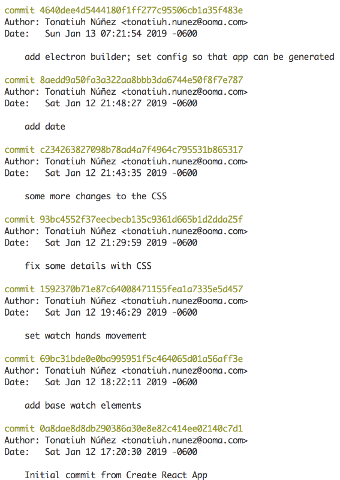
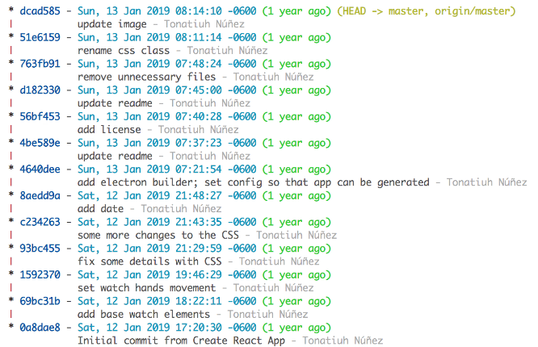

I want to share with you some of the "tricks" that I know for Git in the Terminal. These tricks can be handy and help you do certain tasks faster in the Terminal.

</br>

##### 1. Prettier and More Concise Git Log  

Personally, I think the default way the Git log is formatted is not the best: it's kind of verbose and doesn't show branch merges:



You can set up the log so that it's more concise and shows branch merges. Add an alias for that:

a) Open (or create) the file ~/.gitconfig 

b) If the "[alias]" section is not in your file, then add it at the top of the file as "[alias]" without quotes

c) Below the "[alias]" section add the following:

```bash
l = log --graph --abbrev-commit --decorate --format=format:'%C(bold blue)%h%C(reset) - %C(bold cyan)%aD%C(reset) %C(bold green)(%ar)%C(reset)%C(bold yellow)%d%C(reset)%n''          %C(     13 white)%s%C(reset) %C(dim white)- %an%C(reset)'
```

You just added a new alias that will show you a prettier and more concise Git log. Call it by typing git l in the terminal. Here is an example of how it should look:



</br>

##### 2. Shorter Git Status Alias  

What about showing a shorter version of the repo status, removing verbose text that is not super necessary? Here is an example of the verbose text that I’m referring to: 


Let's add an alias for that, this alias is going to be called "st". Run the following command in the terminal:

```bash
$ git config --global alias.st "status --short --branch"
```

Now when you want to check your repo's status you can call as git st and get a more concise status. Here is an example of how it should look:


</br>

##### 3. Git Diff of a File in Another Branch  

Let's say you want to see how the modifications you did to file "my_file.rb" in branch "my-branch" compare to the same file in branch "development". You can do from the terminal by calling:

```bash
$ git diff development -- my_file.rb
```

</br>

##### 4. See the Content of a File in Another Branch  

Sometimes you're working on a file "my_file.rb" on a branch "my-branch" and want to see how the whole file looks on branch "development". You can do that from the terminal by calling:

```bash
$ git show development:my_file.txt
```
That's handy when you need to see not only what changed on a file but how the whole file's content looks on another branch.

</br>

##### 5. See What Has Changed on a File Over Time  

Last trick in this post, let's say you want to see when and who introduced a variable or function on file "my_file.rb". What you want to see is the history of the changes in the file and seek for the first time that variable or function was written in the file.

You can do that by calling:

```bash
$ git whatchanged -p my_file.rb
```

So, how about that? Did you already know some of these tricks? Do you find them useful? Let me know in the comments!