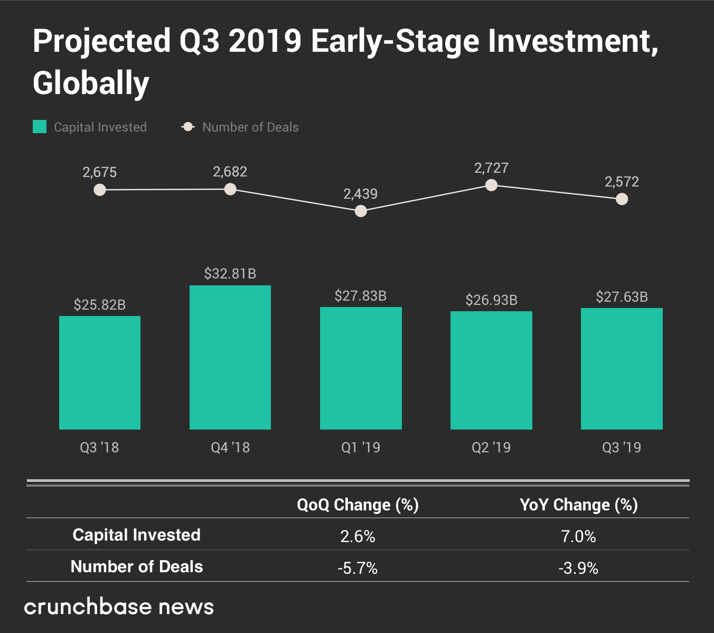
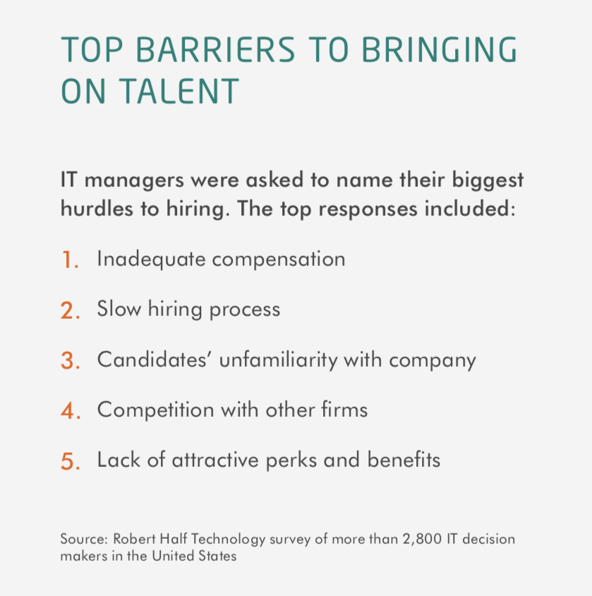
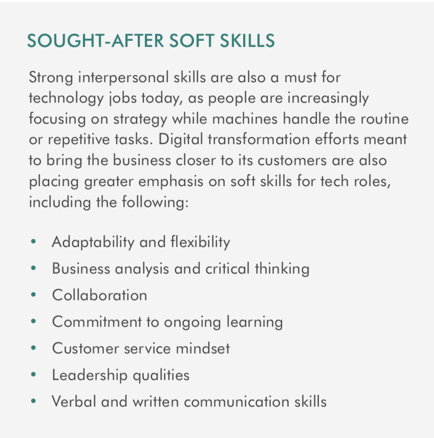

Here we are in the new decade and our collective thirst for innovation & technology continues to grow. Software is ever-ubiquitous, powering all the worlds around us through Clouds, IoT, SaaS, Machine Learning and AI. Early-stage seed investments continue to grow at 15.4% Year over Year (Q3 2019) clip, surpassing 4.4 Billion dollars globally **. Further bolstering that trend, the total number of early-stage projects is up 7% in aggregate, eclipsing 10,000 deals done in 2019 alone.

  

    
  

 

As the number of startups and funding deals continues to grow, so grows the need for quality software developers. In the early days of startup founders creatively bootstrap their coding resources saving valuable dollars to get to the funding round. But what happens when they actually receive the said funding? Investors funding expectations almost always include a faster time to market, and a more immediate ROI. The clock really ticks when you are holding someone else’s money. 

 

#### Challenges of Scaling 

Robert Half has recently published their 2020 salary guide. As one of the largest staffing firms in the world, their yearly report provides great insights as the cross-section of the market today. 

One staggering data point is that San Francisco & San Jose (Silicon Valley) rate the highest in cost of living adjustments in the country (+41%, +40%), exceeding even New York (+39%). In terms of hiring impact, this trend translates to a technical position that might normally $100k (in areas without such growth) now commanding a $140k equivalence in the greater SF Bay Area.  

In these hyper-tech markets, many of the aforementioned startups above have to compete for manpower with the likes of Facebook, Apple, Amazon, Google. Elite talents in every category are sucked up with the lure of the brand, with still more perks to pair alongside organizational prestige. **According to the report, 89% of IT Leaders face challenges in finding skilled technology professionals creating something much more than just an IT-specific problem.** This is an existential problem with potential time-to-market impacts for which investors will have little appetite. 

The obvious solution is to expand resources to leverage talent pools in other markets, with 95% (per the Robert Half report) of IT leaders said they plan to bring in project professionals (outsource) to support their core staff. As the most common solution to this problem, offshoring provides a huge manpower boost at a cost that is far more palatable for most organizations. But the devils are in the details, as the saying goes, and most teams report challenges inherent to this practice that is perceived as operationally unrealistic.

  

    
The obvious solution is to expand resources to leverage talent pools in other markets, with 95% (per the Robert Half report) of IT leaders said they plan to bring in project professionals (outsource) to support their core staff. As the most common solution to this problem, offshoring provides a huge manpower boost at a cost that is far more palatable for most organizations. But the devils are in the details, as the saying goes, and most teams report challenges inherent to this practice that is perceived as operationally unrealistic.

    
 Organizing the work and documentation overhead for end of the day hand off to the offshore team can be extremely cumbersome, allowing for very little variability in work. (i.e. Not Very Agile). 

    
In response to these difficulties, countless organizations are evolving to incorporate nearshore software partners like Density Labs to ensure their development cycles remain on track.

  

  

    
  

 

#### What is Nearshore? 

Nearshore outsourcing is the practice of leveraging talent located in neighboring countries for services that might otherwise be sourced from within your own country. For those of us in the United States, this commonly means finding resources to complete the work in Canada and Mexico.

 

#### General Benefits of Nearshore 

1. **Time Zone Alignment** - Mirroring standups, meetings, and deadlines allow for teams to interact with each other to achieve both short and long term goals. 
2. **Cultural Alignment** – Great English matters, both professionally and socially, when communicating the nuances of an idea or a problem. 
3. **Cost Efficiency** – Leverage reduced labor costs to speed up development in relation to budget. The ration of manpower expenditures for the United States to Mexico, for example, typically provides something like 3 or 4 resources for the price of just a single domestic US resource. 
4. **Stable talent pool** – Development firms like Density labs manage manpower, recruiting, training to ensure there is always a stable pool of resources with which to scale and grow. 
5. **USMCA IP / protections** – Copyrights, trademarks, and intellectual property protection rights are strengthened through the latest USMCA deal. USMCA Trade Fact Sheet 

 

#### Why Density Labs? The soft stuff matters ... 

  

    
As reflected in the Robert Half 2020 Salary Guide, soft skills have become ever more important in hiring talent. No individual contribution is greater than the collective team, which means that hiring candidates who ”play well with others” and have the soft skills to collaborate and inspire their teammates is critical to success (or at the very least, enhances velocity by minimizing potential conflicts and distractions).

    
 Since our founding in 2016, Density labs has been fortunate to grow our business organically through our valued clients.  Our experience has shown that an intense focus on the soft skills of the candidates we place has been a consistent factor in our growing list of customer projects. 

  

  

    
  

 

The findings in the Robert Half report confirms our internal philosophy and standard culture DNA, which we hail internally as our 4Cs of Success. 

- **Communication** – Fluent English is a must and (of course) constitutes a great starting point. That said, understanding the professional and social nuances of your team workflow is absolutely critical.
- **Culture** – Getting the work done is a given, but how that work is done and how an outsourcing partner works with your existing teams is often the missing link in the chain.  Creating healthy and productive working relationships with our clients’ teams and contributing to the daily dynamics and productivity with active participation is where Density Labs really shines.
- **Capabilities** – Hard technical skills are imperative, but we don’t' stop there. Measuring the aptitude of our team members to continue to grow relevant skill sets allows for an ever evolving and increasing value to our clients.
- **Collaboration** – All of the above individual measures that combine to formulate one decisive question: Does this candidate solve our stated problem(s) and alleviate our ongoing organizational strains? We constantly work with our customers to measure the unmeasurable to guarantee that development works as optimally as possible. 

 

#### A New Perspective, Conclusion 

As we all enter into this new decade the need for new technology solutions and ideas fueled by amazing software will continue to grow. Investments and funding of these ideas put immense pressure on the need to accelerate development and time-to-market, often assuming that development resources are abundant and available at a time of scaling. 

Unique market conditions, such as those in hyper-technical markets (San Francisco, Seattle, New York, Etc.), are making it difficult for early-stage companies to compete for manpower. Due to the inherent benefits associated with nearshoring software development, the practice has gained enormous traction and is becoming a popular work-around to the challenges of traditional hiring. Nearshore partners like Density Labs not only provide a stable pool of capable developers when needed, but also ensure the right fit for your team with our acute focus on the key soft skills (4Cs). 

 
