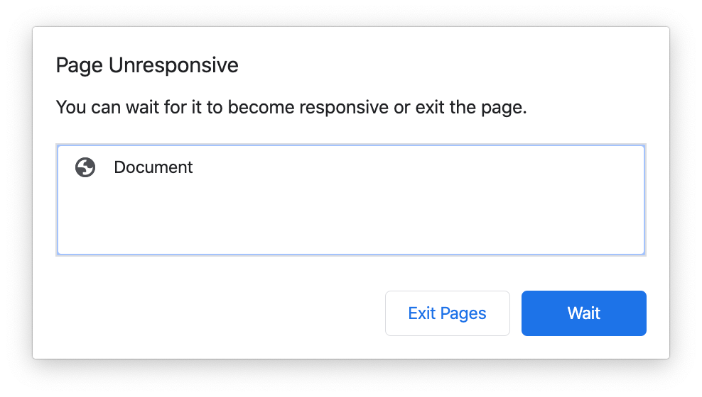

As we already know, JavaScript is single-threaded, which means it can only execute one thing at a time. If we run expensive operations on it, we can easily block the [Event Loop](https://www.youtube.com/watch?v=8aGhZQkoFbQ) and the page might become unresponsive.

<div class="row my-4">
  <div class="col-12 col-md-6 mx-auto">
    
  </div>
</div>

So, what if our project depends on running expensive operations like processing large arrays, image filtering, analyzing video or audio data?

Let me introduce you to Web Workers.

Web Workers are a means of running JavaScript code in background threads, this can give our application superpowers.

In this blog post, I’ll cover how to create our first Web Worker and how the Web Worker communicates with the main thread and vice-versa.

Communicating between them is done with event listeners and the `postMessage` function. Here is a quick example of how to get it working, take your time to analyze the code.

```javascript
// main.js
const worker = new Worker('worker.js');
const data = 1;

worker.postMessage(data);

worker.addEventListener('message', event => {
  const result = event.data;
  console.log(result); // Prints "2"
})
```

```javascript
// worker.js
const sumOne = number => number + 1;

addEventListener('message', event => {
  const number = event.data;
  const result = sumOne(number);

  postMessage(result);
})
```
</br>

As you can see, the message/data is being sent by the `postMessage` function and the worker is receiving the number with the event listener and sending a result back using its own `postMessage` function. In this case, we are only passing a number but, depending on the browser/version you can also pass a JSON object.

One thing we need to keep on mind is that Workers have limitations, they do not have access to:

* The DOM
* The `window` object
* The `document` object
* The `parent` object

If you need to constantly access them, Web Workers would not be the right solution. You may find it useful to take advantage of the Event Loop instead.

## Practical example

Let’s say we have an expensive operation that takes 5 seconds to complete. If we run it using the main thread as we normally do, we are going to block the UI.

We can show that with the following visual example:

<p>
  <div class="row mb-4">
    <div class="col-12 col-md-10 d-flex justify-content-center mx-auto">
      
    </div>
  </div>
</p>


The page was fully responsive before running the operation.

One thing to keep in mind is that we have a performance budget of 16 milliseconds, our functions should not last more than that to have a nice fluid UI. Also, we should try to avoid having operations taking longer than 1 second because the [users can lose focus on the tasks they are performing](https://developers.google.com/web/fundamentals/performance/rail#goals-and-guidelines).

## Result of using a Web Worker

<p>
  <div class="row my-4">
    <div class="col-12 col-md-10 d-flex justify-content-center mx-auto">
      
    </div>
  </div>
</p>

If we use a Web Worker we will notice a huge difference, the operation can run in the background and the user can still interact with the web page.

Here is the code if you want to see how that was accomplished. I used a do-while loop to block the thread for illustrative purposes.

</br>

### Single thread example:

```html
<html>
<head>
  <title>Single Thread example</title>
</head>
<body>
  <div>
    <button id="show-alert">Show alert</button>
  </div>
  <div>
    <button id="run-expensive-operation">Run expensive operation</button>
  </div>
  <script>
    const $runExpensiveOperationBtn = document.getElementById('run-expensive-operation');
    const $showAlertBtn = document.getElementById('show-alert');
    const runExpensiveOperation = (milliseconds) => {
      console.log('Running expensive operation');
      const date = Date.now();
      let currentDate = null;
      do {
        currentDate = Date.now();
      } while (currentDate - date < milliseconds);
    }

    $runExpensiveOperationBtn.addEventListener('click', () => {
      runExpensiveOperation(5000);
    });

    $showAlertBtn.addEventListener('click', () => {
      alert('Alert');
    });
  </script>
</body>
</html>
```
</br>

### Web Worker example

```html
<html>
<head>
  <title>Web Worker example</title>
</head>
<body>
  <div>
    <button id="show-alert">Show alert</button>
  </div>
  <div>
    <button id="run-expensive-operation">Run expensive operation</button>
  </div>
  <script>
    const $runExpensiveOperationBtn = document.getElementById('run-expensive-operation');
    const $showAlertBtn = document.getElementById('show-alert');
    const worker = new Worker('doWork.js');

    worker.addEventListener('message', event => {
      console.log(event.data);
    })

    $runExpensiveOperationBtn.addEventListener('click', () => {
      const ms = 5000;
      worker.postMessage(5000);
    });

    $showAlertBtn.addEventListener('click', () => {
      alert('Alert');
    });
  </script>
</body>
</html>
```

```javascript
// doWork.js

const runExpensiveOperation = (milliseconds) => {
  console.log('Running expensive operation');
  const date = Date.now();
  let currentDate = null;
  do {
    currentDate = Date.now();
  } while (currentDate - date < milliseconds);
}

addEventListener('message', event => {
  const ms = event.data;
  runExpensiveOperation(ms);
  postMessage('Done');
})
```

## Conclusion

Web Workers are useful for operations that can potentially block the UI and don’t require to access the DOM constantly. If you need to constantly access the DOM, using `setTimeout` might be a better approach.

Found this useful or have questions? Let me know in the comments!