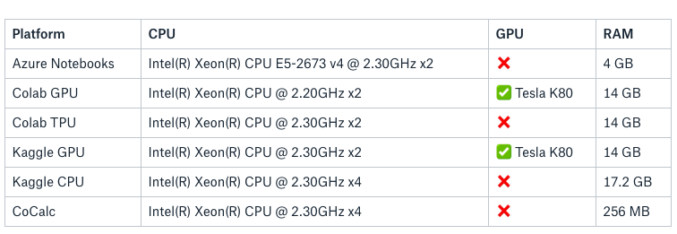

Nowadays, Machine Learning is one of the most popular areas in [Artificial Intelligence](https://www.techopedia.com/definition/190/artificial-intelligence-ai). Although there are a lot of resources online to learn about it [1, 2, 3], practicing it is not as easy and accessible to everyone. Some methods like Deep Learning for image classification require a lot of computational resources. Such is the case of the latest graphics cards (and not any card, you will end up having a lot of problems if you don't invest in Nvidia!), high amounts of RAM to load large datasets into the memory, and of course, a decent CPU. As you may suspect such requirements are quite expensive -e.g. Nvidia GTX 1080i is priced around $900 USD- and not everyone can afford them.

Entrepreneurs and companies noticed this fact and started providing computational platforms dedicated to Machine Learning on the cloud. Big companies like Microsoft, Google and Amazon already have both SaaS and IaaS for that. Although that approach is more feasible for people who can’t afford to purchase brand-new equipment, on the long-term it can become way more expensive- and believe me, training models can take a long, long time.

Fortunately, there are some free options that we can take advantage of. I have tried them all as a result of finding myself in the problem described above; I didn’t have the money to purchase a new computer only for the Deep Learning courses I was taking as part of my Master’s. At that moment, those were my life saviors.

Of course, it is not a silver-bullet solution, but I was capable of surviving with them alone, saving me a lot of money by not paying a single USD.

I will briefly describe some of the available options and provide my feedback on them.

### Option 1: Google Colab

Google’s Colaboratory (Colab) provides an enhanced Jupyter notebook that saves your work automatically in Google Drive. It provides either just a display of the notebook or interaction with it (modifying and running code).

You can see an overview of the platform in this notebook.

PROS:

1. Collaborative editing -multi-user editing.
2. Multiple Python Environments: Python 2 and Python 3.
3. Free GPU and TPU options! -At this moment it provides a Tesla K80 GPU.
4. Google goes beyond the simple Jupyter notebook, including snippets, a table of contents and a file browser.
5. User prompted values -you can introduce custom values and assign them to variables.
6. Can connect to local instances of Jupyter.

CONS:

1. Sometimes the GPU environment cannot be requested because all of them are busy then you’ll have to wait. However, it is not very common for this to happen
2. The collaborative editing has a lot of glitches and sometimes the whole notebook needs to be run again
3. File-management is cumbersome and not very easy to use
4. After some idle time, the kernel disconnects
5. No support for other kernels (R, F#, etc.)

Colab was the platform I had the best experience with. Although the file management is clumsy, two features made it my favorite: the GPU environment and the sharing/collaboration options.

### Option 2: Azure Notebooks

Microsoft’s option to provide Jupyter notebooks on top of their Azure’s platform. You can use it either with the free tier or on your own Azure’s cloud computing environment. There is no need to sign up with your credit card.

PROS:

- Multiple kernels: F#, Python 2/3.5/3.6 and R
- Terminal support (you can start a new terminal session)
- Provides Jupyter Extensions
- Constantly in development
- Easy to download local files

CONS:

- Very slow for Deep Learning
- No GPU/TPU support
- Heavy usage will prompt a captcha to ensure non-malicious activity

When I used the Azure’s notebooks I felt it was sluggish compared to Kaggle or Colab. However I give it points for the constant updates by the Microsoft team and also because it provides a whole Jupyter Notebook environment, plus a terminal to play with.

### Option 3: Kaggle Kernels

Kaggle Kernels is the way Data Scientists or Machine Learning enthusiasts share their work to the Kaggle community, usually participating in competitions and making public their work-in-progress in order to receive feedback or to provide support to other competition peers.

PROS

- Easy to integrate dataset from competitions
- GPU Support (Tesla K80)
- Nice User Interface
- Versioned notebook (commit based)
- Supported kernels: Python and R
- Kernel or dataset cash awards
- Collaborative support

CONS

- Disk space limit. Auto-save up-to 5 GB and 16 GB of temporary space
- Session limit: 6 hours of use
- Private datasets size limit: 20 GB

This is my second-best platform. If you do Kaggle competitions, then it’s a must use. The best feature for me is the integration with Kaggle Datasets and Competitions. You can easily fork and incorporate community work into your own kernel. Moreover, the computational resources they provide are comparable with the ones had by Google’s Colab.

### Option 4: CoCalc

CoCalc is a paid service which includes a free tier that provides very basic functionality, including the creation of Jupyter notebooks and Markdown or LaTeX documents.

Pros

1. Simple to use
2. Support for Julia, R, and SageMath
3. Includes a LaTeX editor

CONS

1. No GPU support
2. Low specs for CPU and RAM
3. Short idle timeout (it restarts after 30 mins idle)
4. No external internet access
5. Very unfriendly user-interface

This was the first and worst platform I used. The free plan practically doesn’t allow you to do anything and the user interface has a lot to improve. I must say that I was on the free tier, but I believe there is no reason to pay more for that platform when other options are available.

Conclusion

I created a summary table with some of the platforms hardware specs.

The above-mentioned options can be a great alternative to buying such computational resources, which by the way is not very cheap. Of course, there are more options in the market, but the ones I described here are the ones I have experience with.

Among them, I would highlight Google Colab and the Kaggle Kernels. When I used them, they were the most useful (and powerful) platforms for me. Furthermore, I still use Colab quite often even for stuff not related to Machine Learning. The worst experience for me was with CoCal, followed by the Azure Notebooks (only because of the lack of GPU and CPU speed).

Regarding areas of opportunity, I would say that all of them could improve their file management features and provide longer data persistence times. However, we should be thankful we can even use them for free.

If you have any doubt or comment, [please send us a message!](https://densitylabs.io/contact-us)
